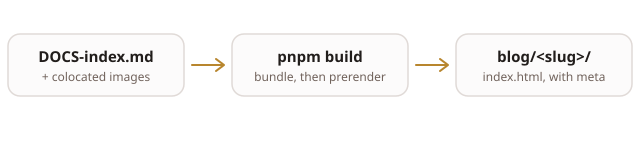

This post exists to prove the pipeline works, and to show what is available
when writing a real one. Delete the whole `src/content/blog/hello-world/`
directory once it has served its purpose.

## Writing a post

Create a directory under `src/content/blog/`. The **directory name is the
slug**, so `src/content/blog/why-i-built-todo/` is served at `/blog/why-i-built-todo`.
Inside it, write `DOCS-index.md` — the `DOCS-` prefix is not decoration, it is
what keeps the file legal under the repo-wide markdown-naming gate.

Frontmatter is strict: an unknown key is a build failure that names the file,
rather than a post that quietly ships without a description.

| Key | Required | Notes |
| --- | --- | --- |
| `title` | yes | Used as the heading and the `<title>` |
| `date` | yes | `YYYY-MM-DD` |
| `summary` | yes | Shown on the index and in link previews |
| `tags` | no | `[a, b]` |
| `cover` | no | Post-relative image for link previews — use PNG or JPG |
| `draft` | no | `true` hides the post everywhere |

## Images

Images live next to the post and are referenced relatively:



Vite rewrites that path to a content-hashed URL. A path that does not resolve
fails `pnpm test` immediately, so a broken image can never reach production.

> One caveat worth knowing: link-preview scrapers do not render SVG. An SVG is
> fine inline, but a `cover:` should be a PNG or a JPG.

## Code

Fenced blocks are highlighted:

```ts
export function slugOf(path: string): string {
  const directory = path.slice(0, path.lastIndexOf("/"));
  return directory.slice(directory.lastIndexOf("/") + 1);
}
```

```bash
pnpm dev      # write, with hot reload
pnpm test     # includes the broken-image check
pnpm build    # typecheck, bundle, then prerender every route
```

## The rest of GFM

Tables, ~~strikethrough~~, task lists and autolinks all work, courtesy of
`remark-gfm`:

- [x] Markdown posts with colocated images
- [x] Real URLs, prerendered for link previews
- [ ] Something worth reading

Links go to [the repo](https://github.com/kuhyx/personal-website), and bare
URLs like https://kuhy.duckdns.org autolink on their own.
